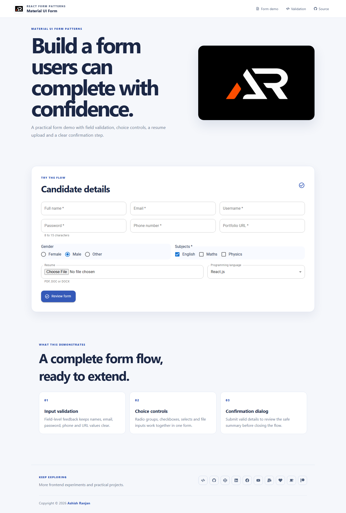

# Material UI Form

A responsive React form demo built with Material UI. It demonstrates practical field validation, grouped inputs, resume upload handling, and a safe confirmation dialog.



## Features

- Responsive Material UI layout with a fixed header and mobile navigation
- Validation for identity, contact, password, and portfolio fields
- Radio buttons, checkboxes, grouped select options, and local file selection
- Confirmation dialog with a privacy-safe submission summary
- Toast feedback, accessible labels, local project assets, and a go-to-top control

## Tech stack

React, Vite, Material UI, Sass, React Icons, and React Toastify.

## Run locally

```bash
npm install
npm run dev
```

## Deployment

The app is deployed to GitHub Pages: [material-ui-form](https://a2rp.github.io/material-ui-form/)

Future improvements can include server-side submission, persistent drafts, and stronger schema-based validation while keeping the current form flow intact.

## Links

- Portfolio: [https://www.ashishranjan.net](https://www.ashishranjan.net)
- GitHub: [https://github.com/a2rp](https://github.com/a2rp)
- CodePen: [https://codepen.io/ash1198](https://codepen.io/ash1198)
- LinkedIn: [https://www.linkedin.com/in/aashishranjan](https://www.linkedin.com/in/aashishranjan)
- Facebook: [https://www.facebook.com/theash.ashish/](https://www.facebook.com/theash.ashish/)
- YouTube: [https://www.youtube.com/@ashishranjan-ashz?sub_confirmation=1](https://www.youtube.com/@ashishranjan-ashz?sub_confirmation=1)
- Email: [ash.ranjan09@gmail.com](mailto:ash.ranjan09@gmail.com)

## Support

- Support: [https://a2rp-donation-page.netlify.app/](https://a2rp-donation-page.netlify.app/)
- Buy Me a Coffee: [https://buymeacoffee.com/a2rp](https://buymeacoffee.com/a2rp)
- Patreon: [https://patreon.com/a2rp](https://patreon.com/a2rp)